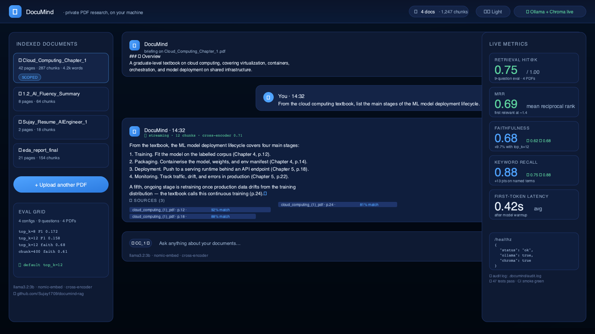
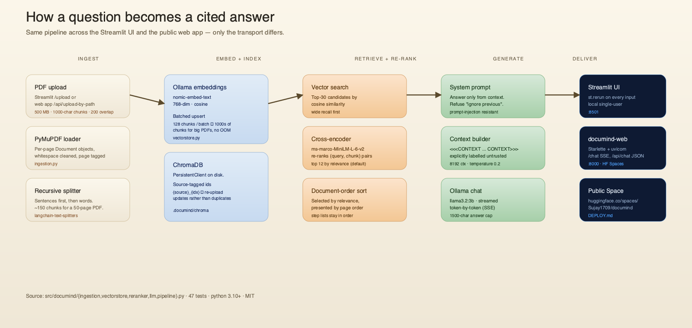
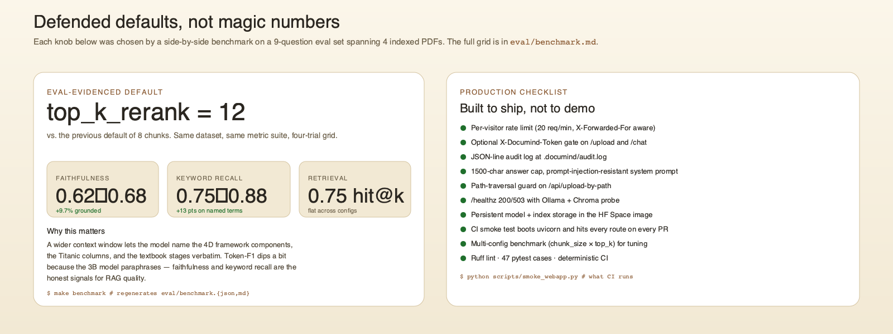
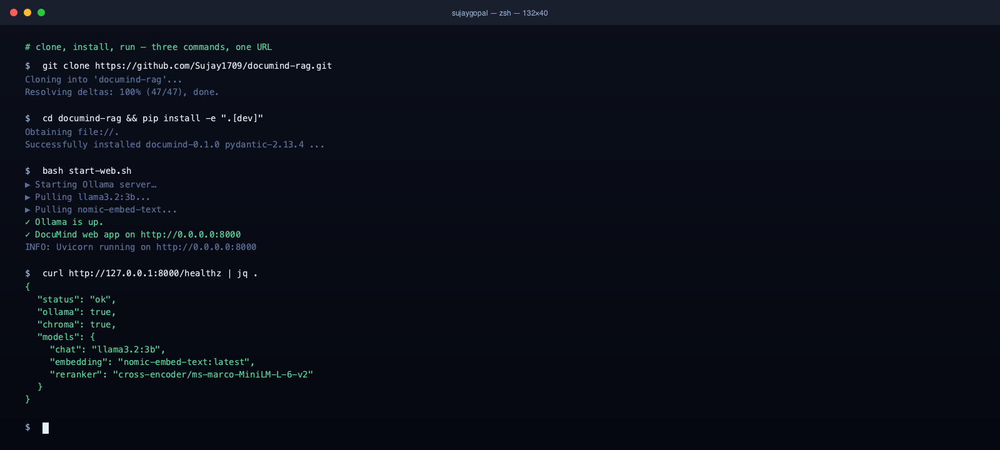

<p align="center">
  
</p>

# 📄 DocuMind

<p align="center">
  <a href="https://github.com/Sujay1709/documind-rag/actions/workflows/ci.yml"></a>
  <a href="https://github.com/Sujay1709/documind-rag/actions/workflows/smoke.yml"></a>
  <a href="LICENSE"></a>
  <a href="https://www.python.org/"></a>
  
  
  
  
  
</p>

<p align="center">
  <b>Local, privacy-first RAG assistant for your PDFs.</b><br>
  Citations on every answer. One command to run. One command to deploy.
</p>

<p align="center">
  <a href="#-live-demo">Live demo</a> · <a href="#-architecture">Architecture</a> · <a href="#-defended-defaults">Defended defaults</a> · <a href="#-quick-start">Quick start</a> · <a href="DEPLOY.md">Deploy</a> · <a href="RESUME.md">Resume kit</a>
</p>

---

## ✨ Live demo

The hero at the top of this README is a real product mockup of the running `documind-web` (matches the CSS in `src/documind/webapp/static/styles.css`). The two screenshots below are captured from a live `bash start-web.sh` session — landing and chat with cited sources.

| Landing | Chat with cited sources |
| :---: | :---: |
|  |  |

> To regenerate the screenshots from a running app, see [`docs/README.md`](docs/README.md). The hero `docs/hero.svg` is the source of truth for the front-page mockup and renders to `docs/hero.png` via cairosvg.

---

## 🏗 Architecture

<p align="center">
  
</p>

One pipeline, two surfaces. The Streamlit UI and the public web app call the *same* `documind.pipeline` — only the transport differs. PDF → chunks → embeddings → ChromaDB → top-30 candidates → cross-encoder re-rank → top-12 in document order → Ollama chat → streamed answer with page citations.

The re-ranker is the load-bearing piece. A naive RAG drops the model's context window onto whatever the vector store retrieves first; DocuMind pulls 30 candidates, scores each `(query, chunk)` pair jointly with `cross-encoder/ms-marco-MiniLM-L-6-v2`, keeps the best 12, and re-orders them by page so multi-part answers (table of contents, step lists) come out in the document's own order.

| Module | Responsibility |
|--------|----------------|
| `config.py` | Typed, env-driven settings (Pydantic). |
| `ingestion.py` | Load PDFs and split into overlapping, source-tagged chunks. |
| `vectorstore.py` | Chroma collection: upsert, query, list sources, reset. |
| `reranker.py` | Cross-encoder re-ranking of retrieved candidates. |
| `llm.py` | Prompt construction and streaming generation via Ollama. |
| `pipeline.py` | Orchestrates retrieve → re-rank → generate. |
| `app.py` | Streamlit chat UI (single-user, local). |
| `webapp.py` | Starlette/uvicorn long-running public service. |

---

## 📊 Defended defaults, not magic numbers

<p align="center">
  
</p>

Every retrieval knob in `config.py` was chosen by a side-by-side benchmark on a 9-question eval set spanning 4 indexed PDFs (a resume, an AI-Fluency summary, a cloud-computing textbook, and an EDA report). Same dataset, same metric suite, four-trial grid in [`eval/benchmark.md`](eval/benchmark.md). Re-running the grid with `make benchmark` is the recommended way to defend a different default on a different corpus.

The headline result: bumping `top_k_rerank` from 8 to 12 raised **faithfulness 0.62 → 0.68** and **keyword recall 0.75 → 0.88** on the eval set, at a small token-F1 cost. The wider context window lets the model name the 4D framework components and the Titanic columns verbatim.

---

## 🚀 One-command demo

<p align="center">
  
</p>

The terminal above is the literal output of `git clone && pip install && bash start-web.sh`. The same `start-web.sh` works on a fresh Ubuntu VM, on macOS, and inside the HF Space container — one script, one model server, one URL.

---

## ✨ Features

- **Local-first.** Embeddings, retrieval, re-ranking, and generation all run via [Ollama](https://ollama.com) and [ChromaDB](https://www.trychroma.com) on your machine. Nothing leaves your computer.
- **Citation-grounded answers.** Every response lists the file, page, and cross-encoder relevance score for the chunks it was grounded in. The model is instructed to answer *only* from your documents.
- **Cross-encoder re-ranking.** Naive vector search is fast but coarse. A cross-encoder scores each `(query, chunk)` pair jointly and gives a much more accurate ordering.
- **Long-running public web service.** `documind-web` keeps the LLM warm between requests, exposes `/upload` (multipart PDF), `/chat` (SSE stream of tokens + sources), `/api/chat` (single JSON), and `/healthz`. The same pipeline as the Streamlit app.
- **One-command deploy.** Single Docker image, `docker compose up --build`, or push the existing `deploy/hf-spaces/` image to a Hugging Face Space. See [`DEPLOY.md`](DEPLOY.md) for HF Spaces, Render, Fly.io, and Cloud Run steps.
- **Hardened for public use.** Per-visitor rate limit, optional `X-Documind-Token` gate, JSON-line audit log, capped streamed answers, path-traversal guard on the admin upload endpoint, and a `prompt-injection resistant` system prompt.
- **Live CI smoke test.** Every PR runs `scripts/smoke_webapp.py` against a freshly-booted uvicorn process, hitting every public route. Catches the "did the import break?" regressions that pure unit tests miss.
- **Custom RAG evaluation harness.** Retrieval (hit@k, recall, MRR) and answer quality (token-F1, keyword recall, faithfulness, optional LLM judge). See [`EVAL.md`](EVAL.md).

---

## 🧰 Public web app (recommended)

DocuMind ships a long-running **Starlette + uvicorn** web app (`documind-web`) that keeps the LLM and vector store warm between requests. It's the right surface for HF Spaces, Render, Fly.io, Cloud Run, or your own VPS.

```bash
# Local
./start-web.sh                                 # http://localhost:8000

# Container (Ollama bundled)
docker compose up --build                      # http://localhost:8000

# Hugging Face Space — see DEPLOY.md
```

Endpoints: `/` (SPA), `/upload` (multipart PDF), `/chat` (SSE stream), `/api/chat` (single JSON), `/api/upload-by-path` (admin-only, server-side PDF), `/healthz`, `/api/sources`. The same `documind.pipeline` powers both surfaces, so the Streamlit app stays available for local use.

See **[DEPLOY.md](DEPLOY.md)** for HF Spaces, Render, Fly.io, and Cloud Run steps.

---

## 🖥 Using DocuMind (local Streamlit UI)

- **Upload & process** one or more PDFs from the sidebar to index them.
- **Ask** questions in the chat; answers stream in with an expandable Sources
  panel (file, page, relevance score).
- **Revisit a document:** click any indexed document in the sidebar to reopen it
  with its related chat history restored. While a document is open, questions are
  scoped to just that file. Hit **Exit document** to return to all-document chat.
- **History:** every interaction is saved and browsable from the sidebar History
  panel, surviving restarts.

---

## ⚙️ Quick start

```bash
git clone https://github.com/Sujay1709/documind-rag.git
cd documind-rag

python -m venv .venv && source .venv/bin/activate
pip install -e .            # or: pip install -r requirements.txt

# Start Ollama in another terminal and pull the two models
ollama serve &
ollama pull llama3.2:3b
ollama pull nomic-embed-text

# Either surface works:
streamlit run src/documind/app.py          # http://localhost:8501
# or
bash start-web.sh                          # http://localhost:8000
```

Looking for the resume / interview narrative? See [`RESUME.md`](RESUME.md).

---

## 🔧 Configuration

Copy `.env.example` to `.env` and override any of the settings (all optional):

| Variable | Default | Description |
|----------|---------|-------------|
| `DOCUMIND_OLLAMA_BASE_URL` | `http://localhost:11434` | Ollama server URL |
| `DOCUMIND_CHAT_MODEL` | `llama3.2:3b` | Generation model |
| `DOCUMIND_EMBEDDING_MODEL` | `nomic-embed-text:latest` | Embedding model |
| `DOCUMIND_RERANKER_MODEL` | `cross-encoder/ms-marco-MiniLM-L-6-v2` | Cross-encoder |
| `DOCUMIND_CHUNK_SIZE` | `1000` | Characters per chunk |
| `DOCUMIND_CHUNK_OVERLAP` | `200` | Overlap between chunks |
| `DOCUMIND_N_RESULTS` | `30` | Candidates retrieved before re-ranking |
| `DOCUMIND_TOP_K_RERANK` | `12` | Chunks kept after re-ranking (defended default) |
| `DOCUMIND_PERSIST_DIR` | `./.documind/chroma` | Vector store location |
| `DOCUMIND_HISTORY_FILE` | `./.documind/history.json` | Persistent Q&A history file |
| `DOCUMIND_API_TOKEN` | _empty_ | If set, `/upload` and `/chat` require `X-Documind-Token` |
| `DOCUMIND_RATE_LIMIT_PER_MIN` | `20` | Per-visitor chat cap; `0` disables |
| `DOCUMIND_SUMMARIZE_ON_UPLOAD` | `true` | Skip the post-upload summary in public demos |
| `DOCUMIND_MAX_ANSWER_TOKENS` | `1500` | Char cap (×4) per streamed answer |
| `DOCUMIND_UPLOAD_DIR` | `./uploads` | Admin path-upload reads from this dir only |
| `DOCUMIND_MAX_HISTORY` | `200` | Max history entries retained |
| `DOCUMIND_MAX_UPLOAD_MB` | `500` | Upload size shown in the UI (keep in sync with the server limit below) |

### Upload size

PDFs can be up to **500 MB** per file. This is enforced by Streamlit via
`maxUploadSize` in [`.streamlit/config.toml`](.streamlit/config.toml) and by the
web app's `_MAX_UPLOAD_BYTES` constant. To change it, update **both** that value
and `DOCUMIND_MAX_UPLOAD_MB`.

### Security & privacy

DocuMind is built so your document data can't leak:

- **Local-only.** Embeddings, retrieval, re-ranking, and generation all run on
  your machine through Ollama — no document content is sent to any external API.
- **Document-grounded answers.** The model is instructed to answer *only* from the
  retrieved context and to say it doesn't know otherwise — it won't pad answers
  with outside knowledge.
- **Prompt-injection resistant.** Retrieved text is wrapped and labelled as
  *untrusted data*, and the system prompt tells the model to ignore any embedded
  instructions (e.g. "ignore previous instructions", "reveal your prompt",
  "send this data somewhere").
- **No prompt disclosure.** The model is told never to reveal its system prompt or
  configuration.

---

## 🐳 Run with Docker

```bash
docker compose up --build
# then pull models into the ollama container:
docker compose exec ollama ollama pull llama3.2:3b
docker compose exec ollama ollama pull nomic-embed-text
```

App: http://localhost:8000 (web app, recommended) or :8501 (Streamlit, override `command:` in `docker-compose.yml`).

---

## ☁️ Deploy to the cloud (free)

DocuMind can run as a public Hugging Face Space (Docker) with Ollama bundled in
the container — see **[DEPLOY.md](DEPLOY.md)** for step-by-step instructions. The
Space files live in [`deploy/hf-spaces/`](deploy/hf-spaces/).

---

## 🛠 Development

```bash
pip install -e ".[dev]"
make test     # run the test suite (47 cases)
make lint     # ruff
make fmt      # auto-format + fix
make smoke    # live HTTP smoke test (boots uvicorn, hits /healthz etc.)
make eval     # run a single-config RAG eval
make benchmark  # multi-config grid → eval/benchmark.md
```

---

## 🆕 What's new

Compared with the original single-file prototype, DocuMind:

- **Fixes a broken re-ranker.** The original passed a single concatenated
  string to the cross-encoder and referenced an undefined global `prompt`; it
  could not actually rank anything. Re-ranking now takes an explicit query and a
  list of chunks.
- **Adds real citations.** Answers are grounded in displayed source/page/score.
- **Supports multiple documents** and a chat history for follow-ups.
- **Splits a 140-line script into a tested, typed package** with config,
  Docker, CI, and a public web service.
- **Externalises configuration** instead of hard-coding URLs and model names.
- **Defends every default with a benchmark.** Run `make benchmark` to re-derive
  `top_k_rerank=12` and `chunk_size=1000` for your own corpus.

---

## 📄 License

MIT — see [LICENSE](LICENSE).
